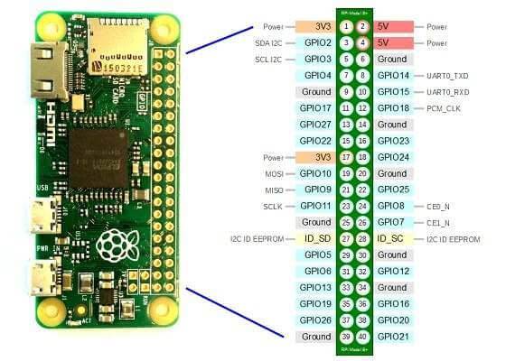

# dht22-mqtt-connector

In this project, a DHT22 temperature and humidity sensor is hooked up to a Raspberry Pi Zero W, which then sends the sensor data to a MQTT broker.

## Topics
1. [Hardware](#hardware)
    - [Setting Up The Pi](#setting-up-the-pi)
    - [Connecting The Sensor](#connecting-the-sensor)

2. [Software](#software)
    - [Interfacing With The Sensor](#interfacing-with-the-sensor)
    - [Implementing MQTT Client](#implementing-mqtt-client)

***

## Hardware

### Setting Up The Pi

Raspberry Pi Zeros do not come installed with GPIO pins. I chose to buy some pins and solder them onto the board. If you have a 3 or 4 series Pi, no need to worry about this.

Not needed, but just wanted to flex my first solder job:


### Connecting The Sensor

This project used the __[AM2302 (wired DHT22) temperature-humidity sensor](https://www.adafruit.com/product/393)__

Since it is a wired sensor, I decided to solder the wires straight onto the corresponding GPIO pins. This is how the GPIO pins are laid out:



I connected the <span style="color: red">red</span> wire of the sensor to pin 1 (3V power), the <span style="color: black, font-weight: bold">black</span> wire to pin 6 (Ground), and the <span style="color: yellow">yellow</span> wire to pin 22.


And here is a picture of the sensor connected to the GPIO pins. I passed the wires through the GPIO opening of the case before soldering the wires on the pins. This makes putting on a case much easier.


***

## Software

### Interfacing With The Sensor

There are a couple of dependencies needed to interface with the sensor. For python, the adafruit circuit python library is needed.
To download, execute in terminal:

```bash
python3 -m pip install adafruit-circuitpython-dht
```

Then, you will want to install the libgpiod2 library to your pi, (assuming you have apt)

```bash
sudo apt-get install libgpiod2
```

### Implementing MQTT Client

The MQTT client library of choice for this project is paho-mqtt. To install:
```
python3 -m pip install paho-mqtt
```

In order for the mqtt script to execute without errors, the program requires a .env file directory in the following format:

```bash
BROKER_ADDRESS=<broker ip address/host name here>
BROKER_PORT=<broker mqtt port>
CLIENT_ID=<client id>
CLIENT_PSSWD=<client-password>
```

